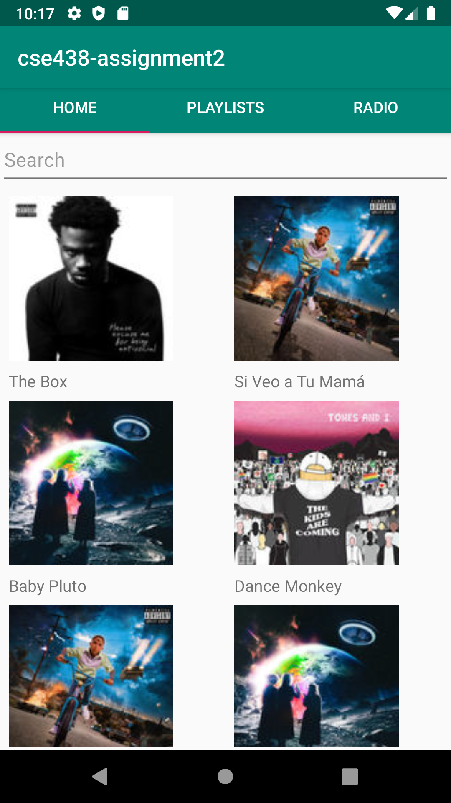
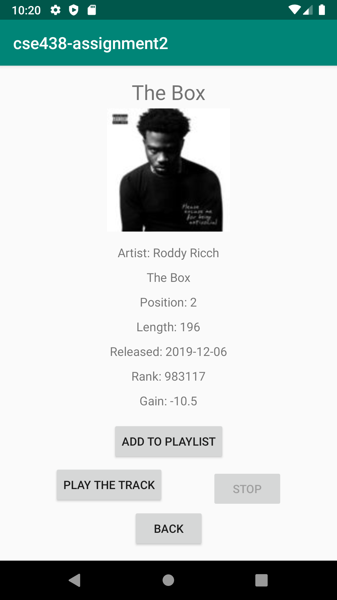
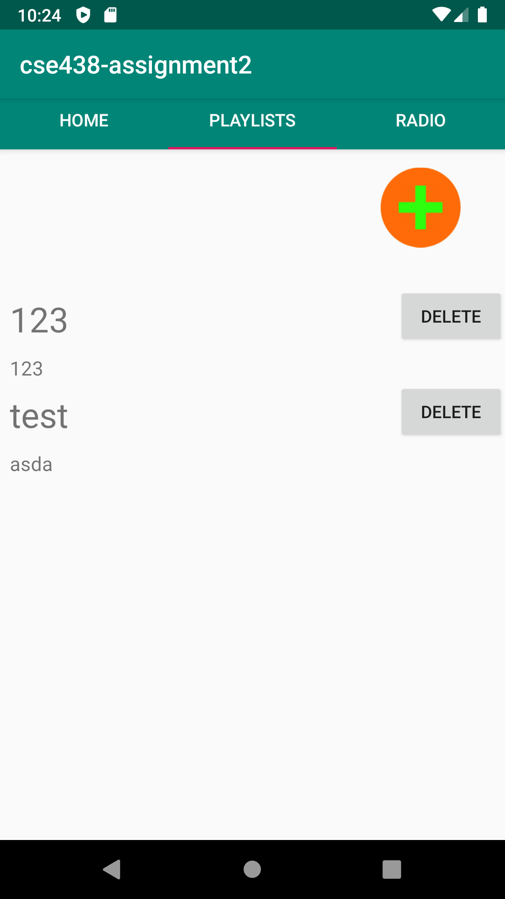
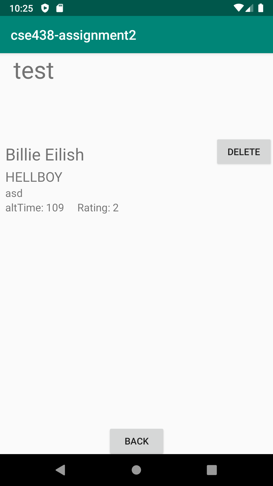
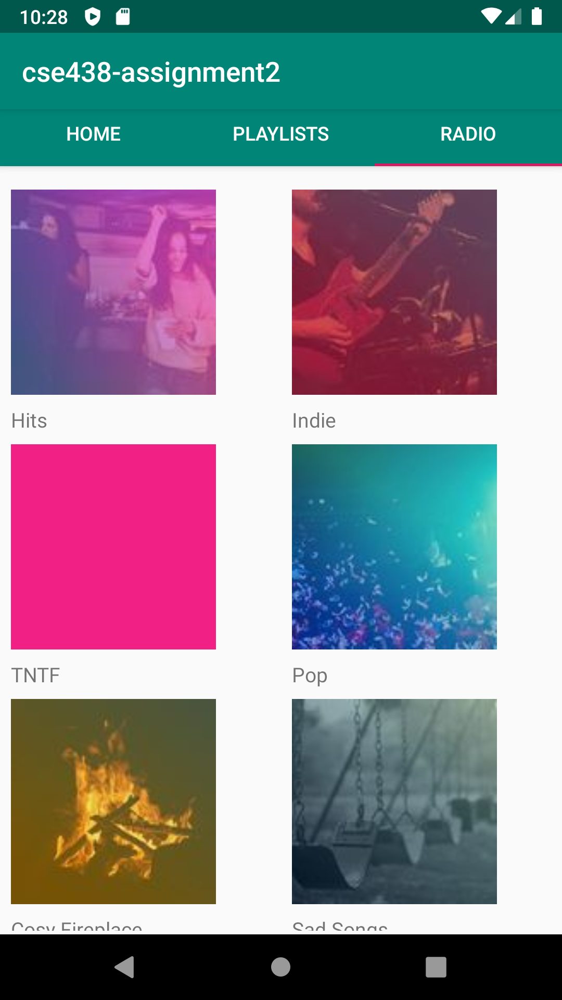

# Music App
@Author Haiyu Wang, Fan Wu

## Resources
* Deezer API: https://developers.deezer.com/api
* SQLite
* Pixel 2 API 28

## Functions
1. Show the popular tracks on starting app with a search bar and show details of each track on clicking the images, including add to playlist and play the track
<figure class="half">
    
    
</figure>

2. Show the playlists, create button. Users can create their own button and add tracks into them. Navigate to the details of tracks when clicking the name of the tracks. Use SQLite to handle the store, add, delete playlists, tracks.
<figure class="half">
    
    
</figure>

3. Show the radios provided by the Deezer API and its tracks in each radio
<figure class="half">
    
    
</figure>
